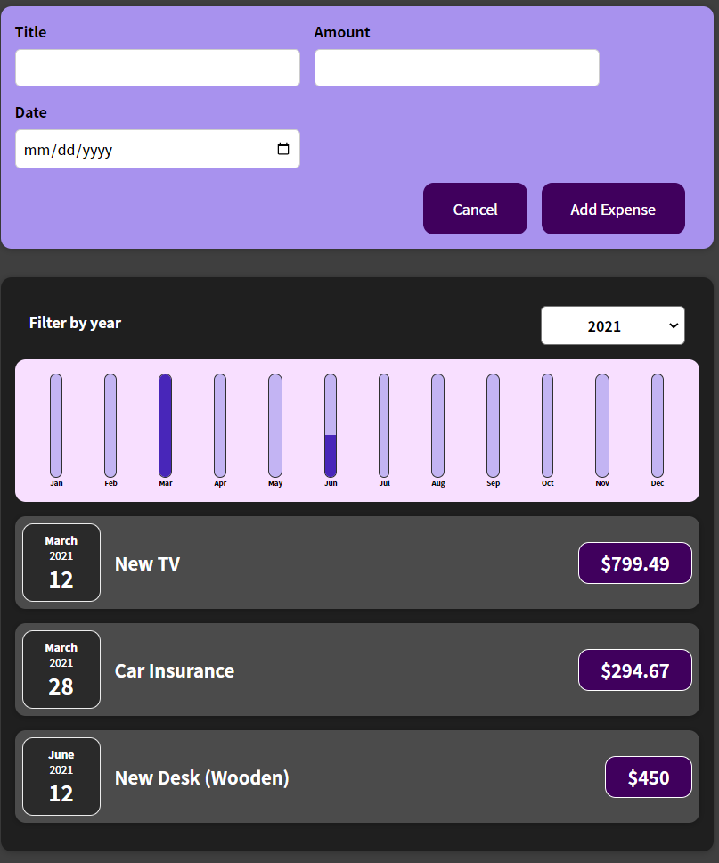

## Table of contents

- [Overview](#overview)
  - [The challenge](#the-challenge)
  - [Screenshot](#screenshot)
  - [Links](#links)
  - [How to install](#how-to-install)

## Overview

### The challenge
a fully responsive and mobile-ready Expenses Tracker Using React

### Screenshot

### Links

- Solution URL: [GitHub](https://github.com/memo-ibrahim-alean/React-Expenses-Tracker)
- Live Site URL: [Live](https://memo-react-expenses-tracker.netlify.app/)

### How to install

- Clone Repo or Download Zip
- Open terminal and write `npm intall` then `npm strat`
- The project can be viewed in the browser at [http://localhost:3000](http://localhost:3000)
- That's it! 🎉
